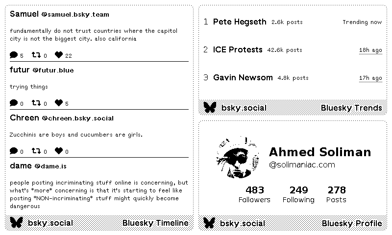

# TRMNL Bluesky Plugins

Unofficial Bluesky plugins for TRMNL e-ink displays. Display your Bluesky timeline and trending topics on your TRMNL device.




## Overview

This repository contains Node.js scripts and Liquid templates for integrating Bluesky social media data with TRMNL displays. The plugins fetch data from Bluesky's API and display it on your TRMNL device using webhook-based custom plugins.

### Available Plugins

- **Timeline Plugin**: Displays your Bluesky timeline with post content and engagement metrics
- **Trends Plugin**: Shows trending topics on Bluesky with post counts and trending status

## Requirements

- Node.js 22.x
- A TRMNL device
- A Bluesky account with an app password
- A hosting solution for running the sync scripts periodically (e.g., Heroku, cron server, or local machine)

## Setup

### 1. Bluesky Configuration

1. Generate an app password from your Bluesky account:
   - Go to [https://bsky.app/settings/app-passwords](https://bsky.app/settings/app-passwords)
   - Create a new app password
   - Save this password securely

### 2. TRMNL Plugin Configuration

1. Log into your TRMNL dashboard
2. Navigate to Plugins > Private Plugin
3. Create a new private plugin:
   - Select "Webhook" as the strategy
   - Copy the webhook URL provided
   - Paste the appropriate template from the `templates/` directory into the markup section
   - Save the plugin

### 3. Environment Variables

Create a `.env` file in the project root based on the provided [`.env.sample`](.env.sample) file. Copy `.env.sample` to `.env` and update it with your actual credentials and webhook URLs.

### 4. Installation

```bash
npm install
```

## Usage

### Manual Execution

Run the sync scripts manually:

```bash
# Sync timeline data
node sync-timeline.js

# Sync trends data
node sync-trends.js
```

### Automated Execution with Cron

Set up cron jobs to run the scripts periodically:

```bash
# Run timeline sync every 30 minutes
*/30 * * * * cd /path/to/trmnl-bsky && node sync-timeline.js

# Run trends sync every hour
0 * * * * cd /path/to/trmnl-bsky && node sync-trends.js
```

### Running on Heroku with Heroku Scheduler

1. Create a new Heroku app and deploy this repository
2. Set the environment variables in Heroku:
   ```bash
   heroku config:set BSKY_IDENTIFIER=your.handle@bsky.social
   heroku config:set BSKY_APP_PASSWORD=your-app-password
   heroku config:set TRMNL_CUSTOM_PLUGIN_TIMELINE_WEBHOOK_URL=your-webhook-url
   heroku config:set TRMNL_CUSTOM_PLUGIN_TRENDS_WEBHOOK_URL=your-webhook-url
   ```
3. Add Heroku Scheduler add-on:
   ```bash
   heroku addons:create scheduler:standard
   ```
4. Configure scheduled jobs in Heroku Scheduler dashboard:
   - Add job: `node sync-timeline.js` (run every 30 minutes)
   - Add job: `node sync-trends.js` (run every hour)

## Templates

The `templates/` directory contains Liquid templates for rendering data on your TRMNL display:

- `timeline.liquid`: Displays posts from your timeline with author info and engagement stats
- `trends.liquid`: Shows trending topics in a grid layout with post counts
- `profile.liquid`: (If applicable) Displays profile information

Copy and paste the desired template into the markup field when creating your custom plugin in TRMNL.

## License

This project is licensed under the MIT License. See the [LICENSE](LICENSE) file for details.

## Disclaimer

This is an unofficial plugin and is not affiliated with, endorsed by, or associated with Bluesky or TRMNL. All trademarks belong to their respective owners.

## Contributing

Contributions are welcome! Please feel free to submit issues or pull requests.

## Related Links

- [TRMNL Documentation](https://help.usetrmnl.com/)
- [TRMNL Private Plugins Guide](https://help.usetrmnl.com/en/articles/9510536-private-plugins)
- [Bluesky API Documentation](https://docs.bsky.app/)